# nomad-in-a-box

# how to use

## local development on your laptop
```
vagrant up
```

Vault root token is `changeme`

Then you can reach the services at

- consul http://localhost:8500
- nomad http://localhost:4646
- vault http://localhost:8200

Or you can also use:

- consul http://consul.127.0.0.1.xip.io:8000
- nomad  http://nomad.127.0.0.1.xip.io:8000
- vault  http://vault.127.0.0.1.xip.io:8000

## operation

Use this project as a black box, or inspiration how to setup a dev environment

### Up

```bash
0 kikitux nomad-in-a-box (master) $ time vagrant up
..
real	4m35,484s
user	0m7,809s
sys	0m2,528s
0 kikitux nomad-in-a-box (master) $
```

### Suspend

Vagrant can suspend the running VM, ie a laptop sleeping/hybernating

```
0 kikitux nomad-in-a-box (master) $ vagrant suspend
==> default: Saving VM state and suspending execution...
0 kikitux nomad-in-a-box (master) $ time vagrant up
Bringing machine 'default' up with 'virtualbox' provider...
==> default: Checking if box 'alvaro/bionic64' version '18.01.04' is up to date...
==> default: Resuming suspended VM...
==> default: Booting VM...
==> default: Waiting for machine to boot. This may take a few minutes...
    default: SSH address: 127.0.0.1:2222
    default: SSH username: vagrant
    default: SSH auth method: private key
==> default: Machine booted and ready!
==> default: Machine already provisioned. Run `vagrant provision` or use the `--provision`
==> default: flag to force provisioning. Provisioners marked to run always will still run.

real	0m26,084s
user	0m2,347s
sys	0m1,122s
0 kikitux nomad-in-a-box (master) $ 
```

### Restart

Once provision our VM can be stopped and started, and the LXC containers will start automatically.

```bash
0 kikitux nomad-in-a-box (master *) $  vagrant halt
==> default: Attempting graceful shutdown of VM...
==> default: Forcing shutdown of VM...
0 kikitux nomad-in-a-box (master *) $ time vagrant up
..
==> default: Booting VM...
==> default: Waiting for machine to boot. This may take a few minutes...
..
==> default: Machine booted and ready!
==> default: Checking for guest additions in VM...
==> default: Setting hostname...
==> default: Mounting shared folders...
    default: /vagrant => /home/kikitux/Dropbox/local/nuc8/nomad-in-a-box
..

real	0m27,165s
user	0m3,291s
sys	0m1,676s
0 kikitux nomad-in-a-box (master *) $ 
```


### vault

Vault is running on dev mode in dc1, so you can access the service as:

- `vault.service.consul` in the dc1
- `vault.service.dc1.consul` in the dc2

### terraform and nomad

in `tf_local` there is a terraform project you can use to schedule a sample job in the nomad cluster with Terraform.

When this job runs:
- a job named hello will run in nomad, count 4, with a basic webpage
- a service named `hello` will be registered in consul
- consul-template will configure nginx on port 8080 on the VM

Website will be available at http://hello.127.0.0.1.xip.io:8080

```
Hello! We are running on
datacenter: dcN
hostname: clientN-dcN
port: 8080
```

## description

This projects uses LXD to create containers.

```
# lxc list
+-------------+---------+--------------------------------+------+------------+-----------+
|    NAME     |  STATE  |              IPV4              | IPV6 |    TYPE    | SNAPSHOTS |
+-------------+---------+--------------------------------+------+------------+-----------+
| base        | STOPPED |                                |      | PERSISTENT | 0         |
+-------------+---------+--------------------------------+------+------------+-----------+
| base-client | STOPPED |                                |      | PERSISTENT | 0         |
+-------------+---------+--------------------------------+------+------------+-----------+
| client1-dc1 | RUNNING | 172.17.0.1 (docker0)           |      | PERSISTENT | 0         |
|             |         | 10.170.13.41 (eth0)            |      |            |           |
+-------------+---------+--------------------------------+------+------------+-----------+
| client1-dc2 | RUNNING | 172.17.0.1 (docker0)           |      | PERSISTENT | 0         |
|             |         | 10.170.14.41 (eth0)            |      |            |           |
+-------------+---------+--------------------------------+------+------------+-----------+
| client2-dc1 | RUNNING | 172.17.0.1 (docker0)           |      | PERSISTENT | 0         |
|             |         | 10.170.13.42 (eth0)            |      |            |           |
+-------------+---------+--------------------------------+------+------------+-----------+
| client2-dc2 | RUNNING | 172.17.0.1 (docker0)           |      | PERSISTENT | 0         |
|             |         | 10.170.14.42 (eth0)            |      |            |           |
+-------------+---------+--------------------------------+------+------------+-----------+
| consul1-dc1 | RUNNING | 10.170.13.11 (eth0)            |      | PERSISTENT | 0         |
+-------------+---------+--------------------------------+------+------------+-----------+
| consul1-dc2 | RUNNING | 10.170.14.11 (eth0)            |      | PERSISTENT | 0         |
+-------------+---------+--------------------------------+------+------------+-----------+
| consul2-dc1 | RUNNING | 10.170.13.12 (eth0)            |      | PERSISTENT | 0         |
+-------------+---------+--------------------------------+------+------------+-----------+
| consul2-dc2 | RUNNING | 10.170.14.12 (eth0)            |      | PERSISTENT | 0         |
+-------------+---------+--------------------------------+------+------------+-----------+
| consul3-dc1 | RUNNING | 10.170.13.13 (eth0)            |      | PERSISTENT | 0         |
+-------------+---------+--------------------------------+------+------------+-----------+
| consul3-dc2 | RUNNING | 10.170.14.13 (eth0)            |      | PERSISTENT | 0         |
+-------------+---------+--------------------------------+------+------------+-----------+
| nomad1-dc1  | RUNNING | 10.170.13.31 (eth0)            |      | PERSISTENT | 0         |
+-------------+---------+--------------------------------+------+------------+-----------+
| nomad1-dc2  | RUNNING | 10.170.14.31 (eth0)            |      | PERSISTENT | 0         |
+-------------+---------+--------------------------------+------+------------+-----------+
| nomad2-dc1  | RUNNING | 10.170.13.32 (eth0)            |      | PERSISTENT | 0         |
+-------------+---------+--------------------------------+------+------------+-----------+
| nomad2-dc2  | RUNNING | 10.170.14.32 (eth0)            |      | PERSISTENT | 0         |
+-------------+---------+--------------------------------+------+------------+-----------+
| nomad3-dc1  | RUNNING | 10.170.13.33 (eth0)            |      | PERSISTENT | 0         |
+-------------+---------+--------------------------------+------+------------+-----------+
| nomad3-dc2  | RUNNING | 10.170.14.33 (eth0)            |      | PERSISTENT | 0         |
+-------------+---------+--------------------------------+------+------------+-----------+
| vault1-dc1  | RUNNING | 10.170.13.21 (eth0)            |      | PERSISTENT | 0         |
+-------------+---------+--------------------------------+------+------------+-----------+
# 

```

# Screenshots
- consul
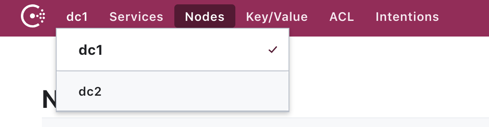
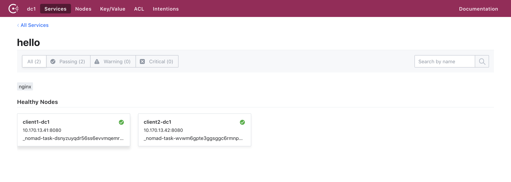
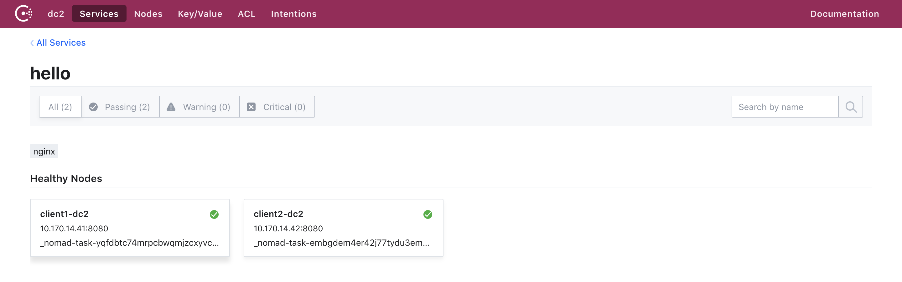
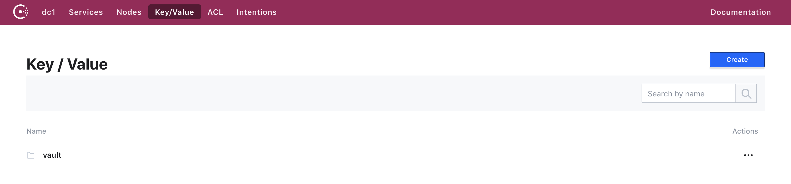
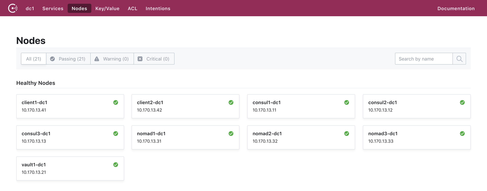
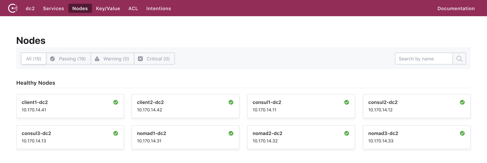
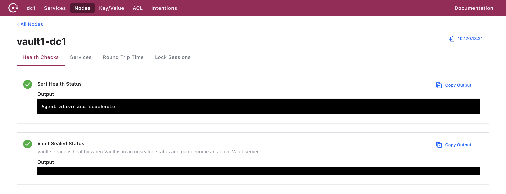
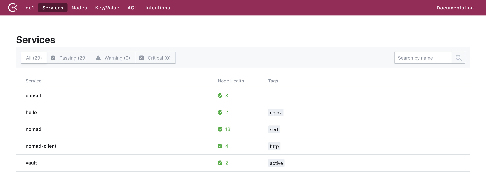
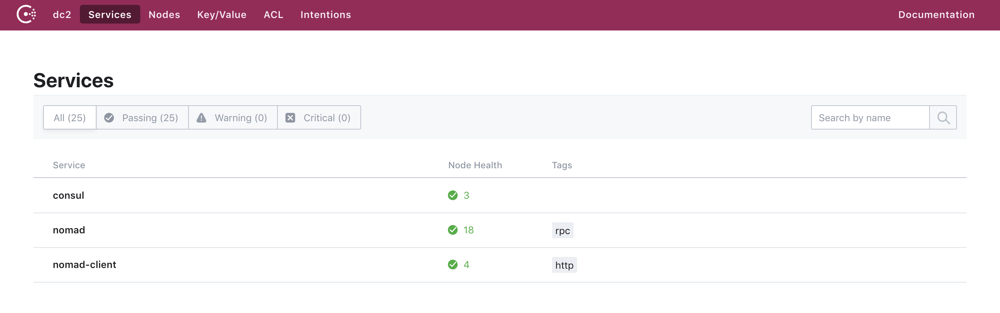

- nomad
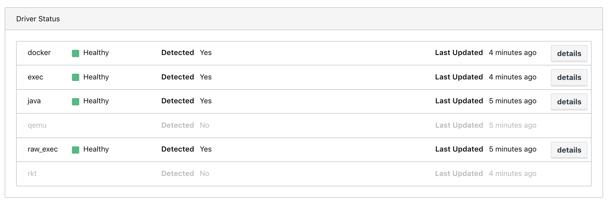
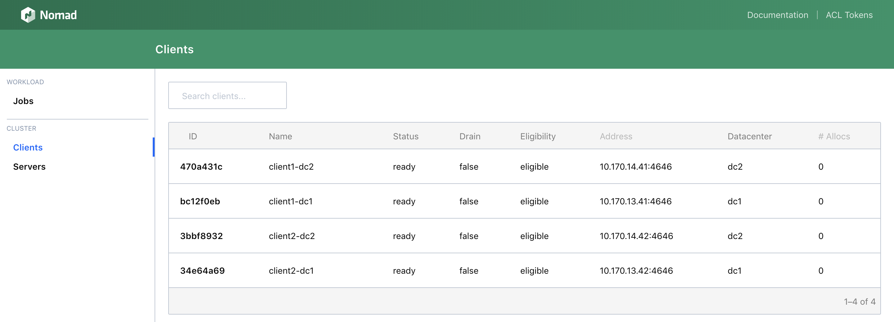
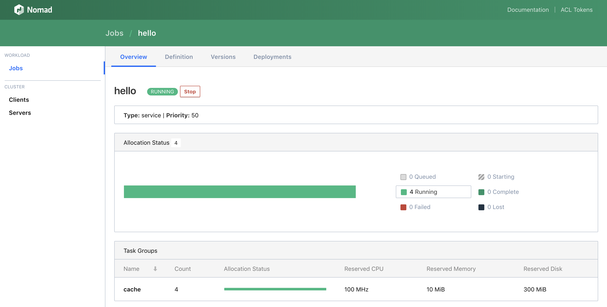
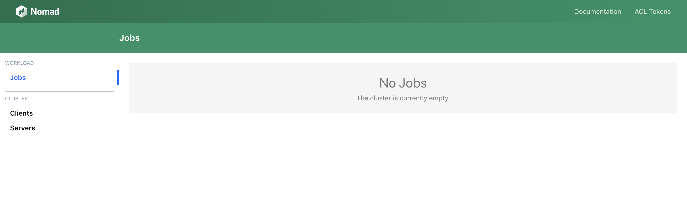
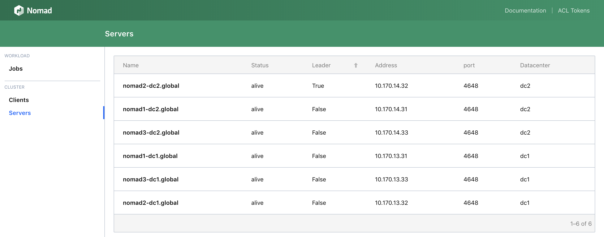

- vault
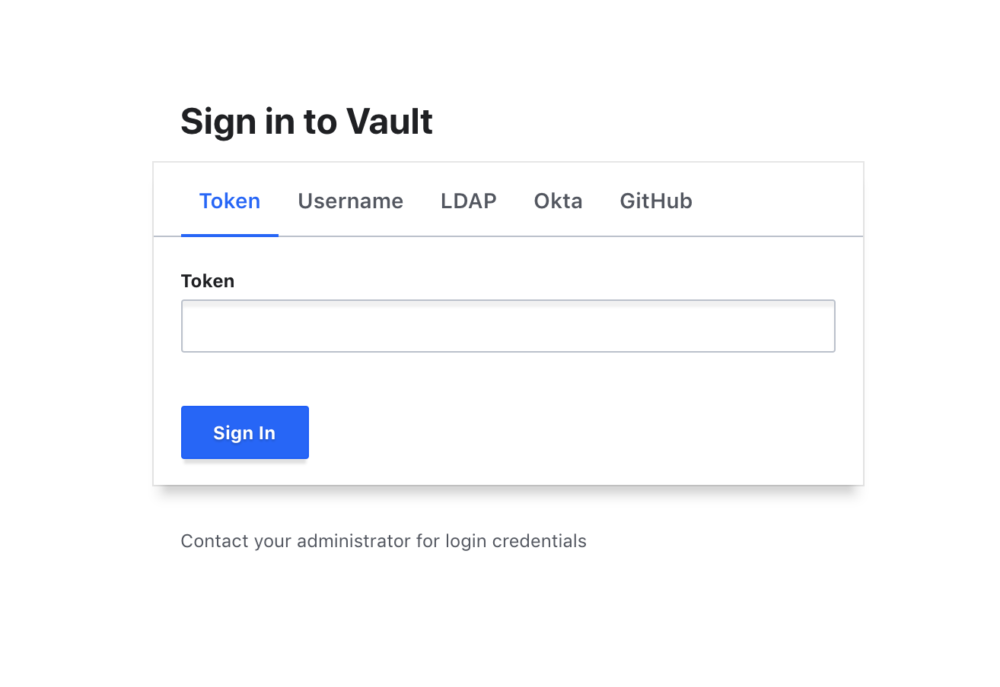
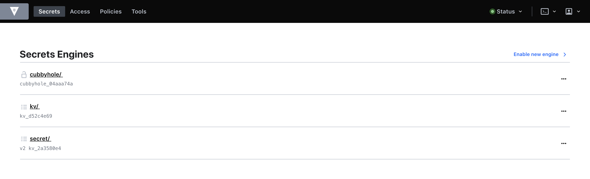
